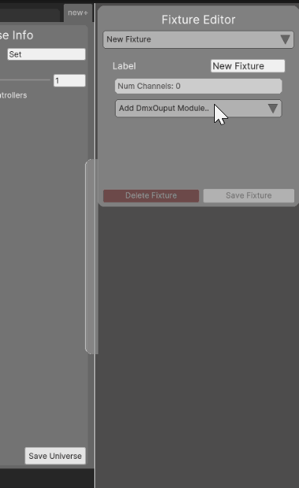
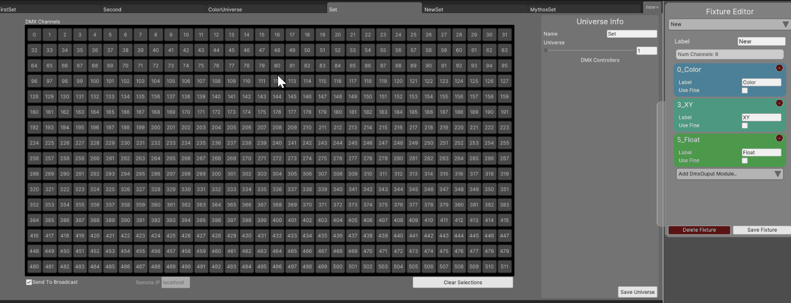
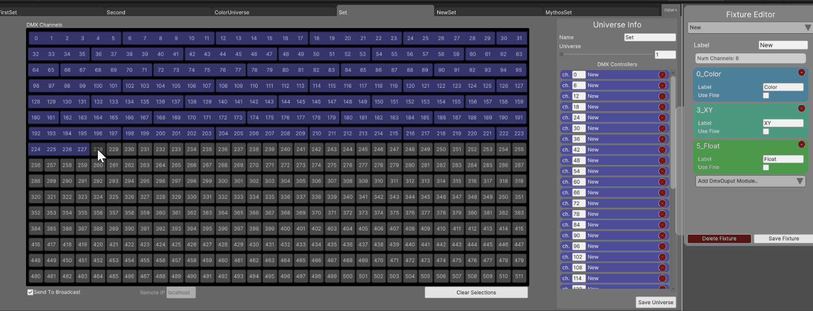
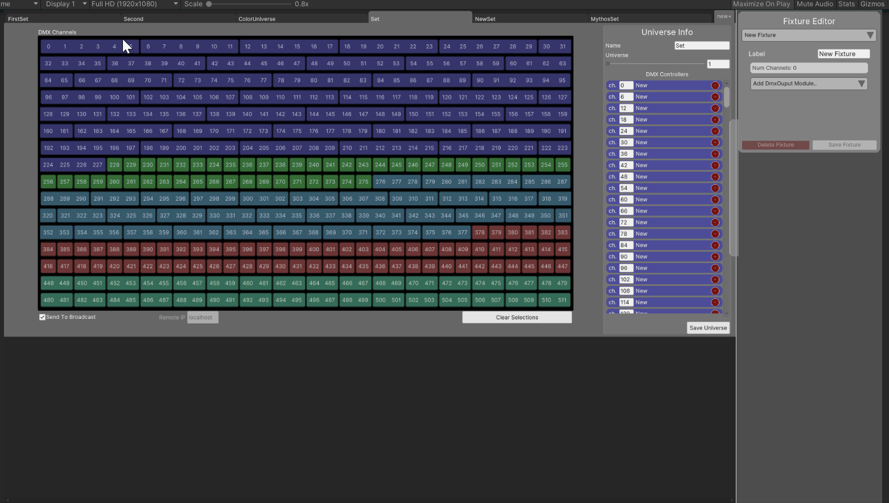
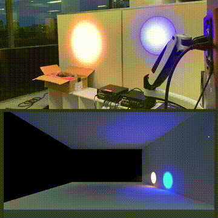
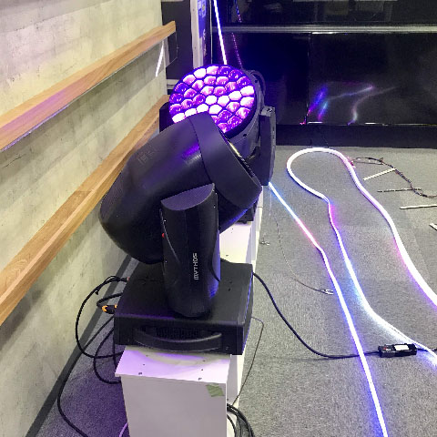

# ArtNetController

- This Project is for practice using UIElements and UniRX
- Application to send ArtNet
- Edit and save the controller
- Send DMX via ArtNet

## Futures

### Edit DMX Control Fixture

- Float Control
- Selector Control
- Bool Control
- XY Control
- Color Control

### Edit Universe Channel

#### Add Fixtures

#### Add DMX Controls

### Operate DMX Controllers

- Press the Shift key to operate multiple controllers
- コントローラーUIを同時に操作すると重いから、表示しない方がいいかも知れん

## Control Virtual/Real DMX Devices

## Using

- [UIElements / UI Toolkit](https://docs.unity3d.com/2021.1/Documentation/Manual/UIElements.html)
- [UniRX](https://github.com/neuecc/UniRx)